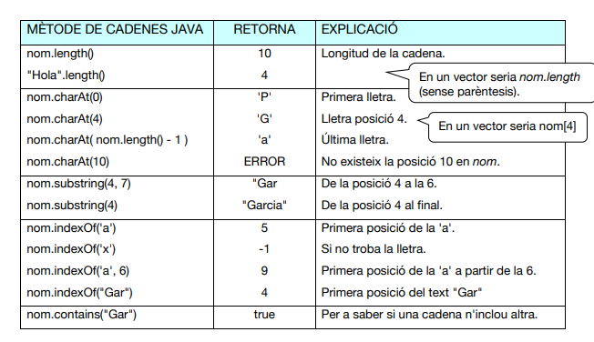
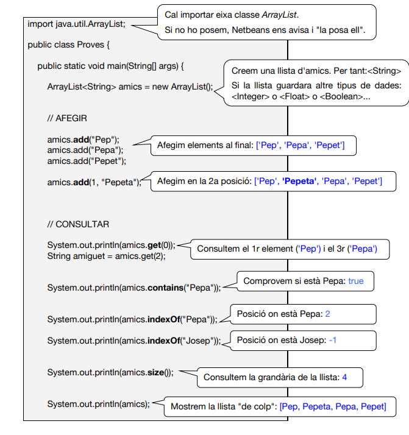
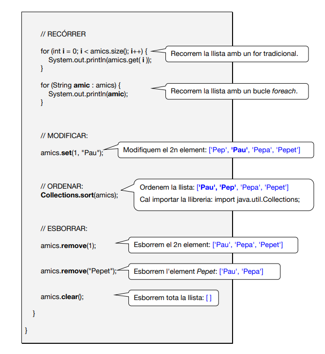
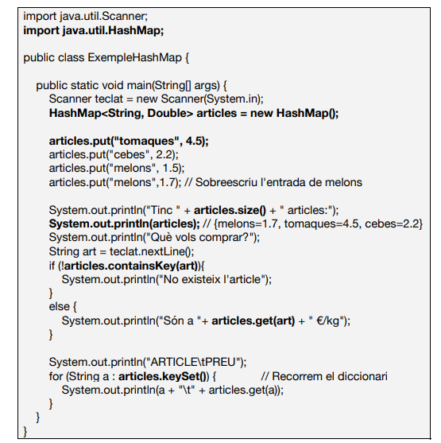

# Apuntes de Java Básico

## 2. Declaración e inicialización de variables

```java
int    n;             // declaración sin inicializar (valor por defecto 0)
double precio = 19.99;
String mensaje = "Java es divertido";
boolean activo = true;
```

## 3. Estructuras de control

– **if / else**: flujo condicional

```java
if (cond) { ... } else if (otra) { ... } else { ... }
```

– **while**: bucle pre-test

```java
while (cond) { ... }
```

– **do-while**: bucle post-test (al menos 1 vez)

```java
do { ... } while (cond);
```

– **for**: bucle indexado

```java
for (int i = 0; i < 10; i++) {
    ...
}
```

## 4. Comentarios

```java
// comentario de línea
/*
 comentario
 de varias líneas
*/
```

## 5. Estructura mínima de una clase

```java
public class MiClase {
    public static void main(String[] args) {
        System.out.println("¡Hola Java!");
    }
}
```

---

# 6. Cadenas de caracteres (`String`)

Las cadenas en Java son objetos inmutables de la clase `String`. Cada operación devuelve una nueva cadena sin modificar la original.

```java
String s = "Hola Mundo";      // Declaración e inicialización
```

### 6.1 Operaciones comunes

* **longitud**: `s.length()` devuelve el número de caracteres.
* **acceso**: `s.charAt(i)` obtiene el carácter en la posición `i`.
* **subcadena**: `s.substring(a, b)` extrae caracteres desde `a` hasta `b-1`.
* **búsqueda**: `s.indexOf("x")` localiza la primera posición de la subcadena.
* **comparación**: `s.equals(t)` vs. `s.equalsIgnoreCase(t)`.
* **transformación**: `s.toLowerCase()`, `s.toUpperCase()`, `s.trim()`, `s.replace(old, new)`.
* **división**: `s.split("sep")` fragmenta la cadena en un array.

### 6.2 Ejemplo detallado: StringDemo.java

```java
public class StringDemo {
    public static void main(String[] args) {
        String texto = "  Java Básico  ";
        System.out.println("Original: '" + texto + "'");
        System.out.println("Trim: '" + texto.trim() + "'");
        System.out.println("Mayúsculas: " + texto.toUpperCase().trim());
        System.out.println("Longitud: " + texto.length());
        System.out.println("Caracter [2]: " + texto.charAt(2));
        String[] partes = texto.trim().split(" ");
        for (String parte : partes) {
            System.out.println("Parte: " + parte);
        }
    }
}
```

---

# 7. Listas dinámicas (`ArrayList`)

`ArrayList` es una implementación de lista redimensionable. Soporta acceso aleatorio y crece automáticamente.

### 7.1 Uso básico

```java
import java.util.ArrayList;
ArrayList<String> lista = new ArrayList<>();
lista.add("A");        // añade al final
lista.add(0, "B");     // inserta en posición 0
String primer = lista.get(0);
lista.set(1, "C");      // reemplaza elemento en índice 1
lista.remove("B");      // elimina por valor
int tam = lista.size();   
lista.clear();            // vacía la lista
```

### 7.2 Ejemplo detallado: ArrayListDemo.java

```java
import java.util.ArrayList;
public class ArrayListDemo {
    public static void main(String[] args) {
        ArrayList<Integer> nums = new ArrayList<>();
        for (int i = 1; i <= 5; i++) nums.add(i * 10);
        System.out.println("Contenido: " + nums);
        nums.remove(2);  // quita el elemento en índice 2
        System.out.println("Tras remover índice 2: " + nums);
        nums.set(1, 99);
        System.out.println("Tras set en índice 1: " + nums);
    }
}
```

---

# 8. Vectores (arrays) unidimensionales

Un array es una estructura de tamaño fijo que almacena elementos del mismo tipo.

### 8.1 Declaración e inicialización

```java
int[] edats = new int[5];         // valores por defecto 0
int[] diasMes = {31,28,31,30};     
```

### 8.2 Acceso, asignación e iteración

```java
edats[2] = 18;                     // asignar
int x = diasMes[0];                // acceder
for (int i = 0; i < edats.length; i++) System.out.println(edats[i]);
for (int v : diasMes) System.out.println(v);
```

### 8.3 Ejemplo detallado: ArrayDemo.java

```java
public class ArrayDemo {
    public static void main(String[] args) {
        String[] frutas = {"Manzana","Pera","Banana"};
        for (int i = 0; i < frutas.length; i++) {
            System.out.println(i + ": " + frutas[i]);
        }
    }
}
```

---

# 9. Matrices (arrays bidimensionales)

Una matriz es un array de arrays. Útil para representar tablas.

### 9.1 Declaración e inicialización

```java
int[][] m = new int[3][4];       // 3 filas, 4 columnas
int[][] t = {{1,2,3},{4,5,6}};    // 2×3
```

### 9.2 Iteración por filas y columnas

```java
for (int i = 0; i < m.length; i++) {
    for (int j = 0; j < m[i].length; j++) {
        m[i][j] = i + j;
    }
}
```

### 9.3 Ejemplo detallado: MatrixDemo.java

```java
public class MatrixDemo {
    public static void main(String[] args) {
        int[][] tabla = {{1,2,3},{4,5,6},{7,8,9}};
        for (int[] fila : tabla) {
            for (int val : fila) System.out.print(val + " ");
            System.out.println();
        }
    }
}
```

---

# 10. Diccionarios (`HashMap`)

`HashMap<K,V>` almacena pares clave–valor, con acceso promedio O(1).

### 10.1 Operaciones comunes

```java
import java.util.HashMap;
HashMap<String,Integer> map = new HashMap<>();
map.put("A",1);                 // añadir o actualizar
int v = map.get("A");          // obtener (null si no existe)
boolean ok = map.containsKey("B");
map.remove("A");               // eliminar
for (String k : map.keySet()) {
    System.out.println(k + ": " + map.get(k));
}
map.clear();                     // vaciar
```

### 10.2 Ejemplo detallado: HashMapDemo.java

```java
import java.util.HashMap;
public class HashMapDemo {
    public static void main(String[] args) {
        HashMap<String, Double> precios = new HashMap<>();
        precios.put("Café", 1.5);
        precios.put("Té", 1.0);
        for (String producto : precios.keySet()) {
            System.out.println(producto + " → $" + precios.get(producto));
        }
    }
}
```

---

# 11. Constructores y creación de objetos

Los **constructores** son métodos especiales que se ejecutan al instanciar un objeto con `new`. Sirven principalmente para inicializar los atributos.

## 11.1 Sintaxis de un constructor

```java
public class ClaseEjemplo {
    // Atributos
    private String nombre;
    private int valor;

    // Constructor con parámetros
    public ClaseEjemplo(String nombre, int valor) {
        this.nombre = nombre;    // this hace referencia al atributo de instancia
        this.valor = valor;
    }

    // Constructor por defecto (sin parámetros)
    public ClaseEjemplo() {
        this.nombre = "--";
        this.valor = 0;
    }
}
```

* El nombre del constructor **debe coincidir** con el de la clase.
* No tiene tipo de retorno (ni siquiera `void`).
* Puede estar **sobrecargado**: misma firma de nombre, distinta lista de parámetros.
* Si defines cualquier constructor, **no existe** automáticamente el constructor sin parámetros, a menos que lo declares explícitamente.

## 11.2 Creación (instanciación) de objetos

Para crear un objeto usamos el operador `new` junto al constructor deseado:

```java
public class Main {
    public static void main(String[] args) {
        // Usando constructor con parámetros
        ClaseEjemplo obj1 = new ClaseEjemplo("Test", 42);

        // Usando constructor por defecto
        ClaseEjemplo obj2 = new ClaseEjemplo();

        System.out.println("obj1.nombre = " + obj1.getNombre() + ", valor = " + obj1.getValor());
        System.out.println("obj2.nombre = " + obj2.getNombre() + ", valor = " + obj2.getValor());
    }
}
```

## 11.3 Ejemplo completo: Persona.java y UsoPersona.java

**Persona.java**

```java
public class Persona {
    private String nombre;
    private int edad;

    // Constructor con parámetros
    public Persona(String nombre, int edad) {
        this.nombre = nombre;
        this.edad = edad;
    }

    // Constructor por defecto
    public Persona() {
        this("Anonimo", 0);
    }

    public String getNombre() { return nombre; }
    public int getEdad() { return edad; }

    public void saludar() {
        System.out.println("Hola, soy " + nombre + " y tengo " + edad + " años.");
    }
}
```

**UsoPersona.java**

```java
public class UsoPersona {
    public static void main(String[] args) {
        // Instanciamos con el constructor parametrizado
        Persona p1 = new Persona("María", 30);
        p1.saludar();  // Hola, soy María y tengo 30 años.

        // Instanciamos con el constructor por defecto
        Persona p2 = new Persona();
        p2.saludar();  // Hola, soy Anonimo y tengo 0 años.
    }
}
```

---

# 12. Interfaces en Java

Una **interfaz** en Java es un contrato que define un conjunto de métodos (y constantes) que una clase debe implementar. A partir de Java 8, también pueden incluir métodos `default` y `static`.

## 12.1 Declarar una interfaz

```java
public interface Controlable {
    void iniciar();
    void detener();
}
```

* Todos los métodos son `public abstract` por defecto.
* Las constantes se definen con `public static final` (implícito).

## 12.2 Implementar una interfaz

```java
public class Maquina implements Controlable {
    @Override
    public void iniciar() { System.out.println("Máquina iniciada"); }
    @Override
    public void detener() { System.out.println("Máquina detenida"); }
}
```

Una clase puede implementar **múltiples** interfaces (herencia múltiple de tipo).

## 12.3 Métodos por defecto

```java
public interface Disparador {
    default void disparar(){ System.out.println("Bang!"); }
    void recargar();
}
```

Las clases pueden usar la implementación `default` o sobrescribirla.

## 12.4 Las interfaces `Comparable` y `Comparator`

* `Comparable<T>` define `int compareTo(T o)` para el **orden natural** de la clase.
* `Comparator<T>` define `int compare(T a, T b)` para **criterios alternativos**.

```java
public class Persona implements Comparable<Persona> {
    private int edad;
    public int compareTo(Persona o){ return this.edad - o.edad; }
}
// Ordenar lista:
Collections.sort(listaPersonas);

public class ComparadorPorNombre implements Comparator<Persona> {
    public int compare(Persona a, Persona b){
        return a.getNombre().compareTo(b.getNombre());
    }
}
Collections.sort(listaPersonas, new ComparadorPorNombre());
```


Tema 1

// cadenes de text




Copiar

int edat = 18;

if (edat < 18) {
    System.out.println("Eres menor d'edat");
} else if (edat == 18) {
    System.out.println("Tens just 18 anys");
} else {
    System.out.println("Eres major d'edat");
}
🔹 switch
Alternativa a múltiples if quan compares una mateixa variable.


Copiar

int dia = 3;

switch (dia) {
    case 1:
        System.out.println("Dilluns");
        break;
    case 2:
        System.out.println("Dimarts");
        break;
    case 3:
        System.out.println("Dimecres");
        break;
    default:
        System.out.println("Dia desconegut");
}
🔹 while
Executa un bloc de codi mentre la condició siga true.


Copiar

int contador = 0;

while (contador < 5) {
    System.out.println("Valor: " + contador);
    contador++;
}
🔹 do while
Igual que while, però s'executa almenys una vegada.


Copiar

int contador = 0;

do {
    System.out.println("Valor: " + contador);
    contador++;
} while (contador < 5);
🔹 for
Bucle que s’utilitza habitualment per a recorreguts.


Copiar

for (int i = 0; i < 5; i++) {
    System.out.println("i = " + i);
}
🔹 break i continue
break: ix del bucle.

continue: salta a la següent iteració.


Copiar

for (int i = 0; i < 10; i++) {
    if (i == 5) {
        break; // ix del bucle
    }
    if (i % 2 == 0) {
        continue; // salta els parells
    }
    System.out.println("Imparell: " + i);
}


// Arrays, llistes, diccionaris 


Arrays





Diccionaris

